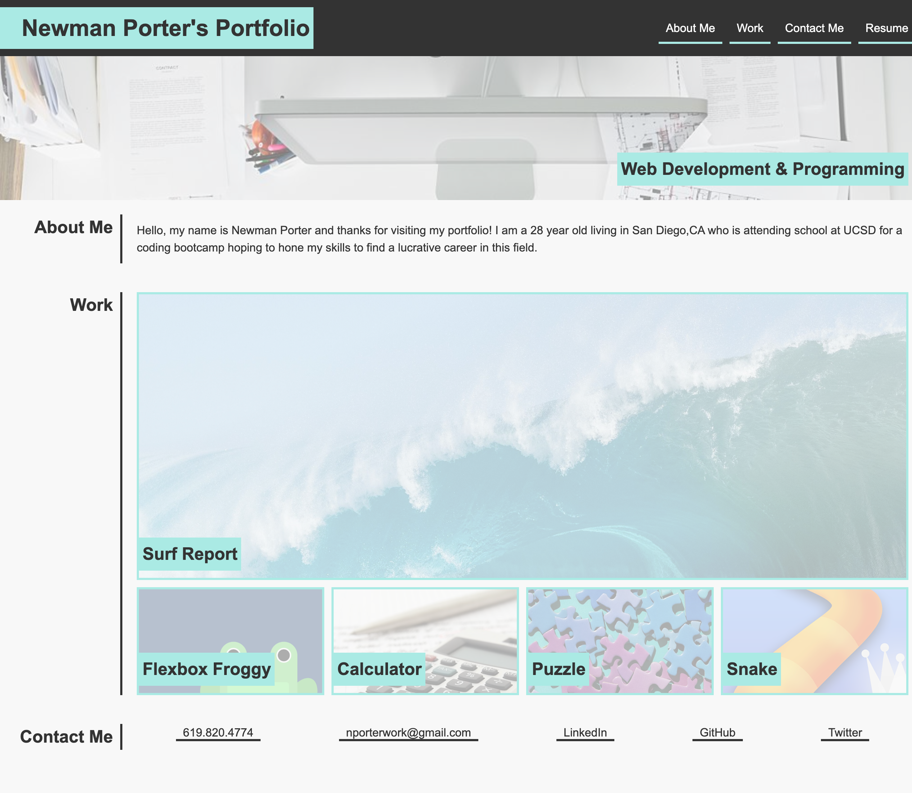

# MyPortfolio
Title: Newman Porter's Portfolio

Description: This application is a rough draft to making a finalized portfolio. I used HTML structure and dove into stylizing with more advanced CSS. I learned how to work with flexboxes and containers to produce the layout I wanted. I also got to play around with new features such as hover navigation bars and working links. I faced some challenges with overlapping classes, but mangaged to work out most of the kinks by creating more and asigning specific changes through trial and error.

License:N/A

 Screenshot

https://nporter619.github.io/MyPortfolio/   Link to deployed application